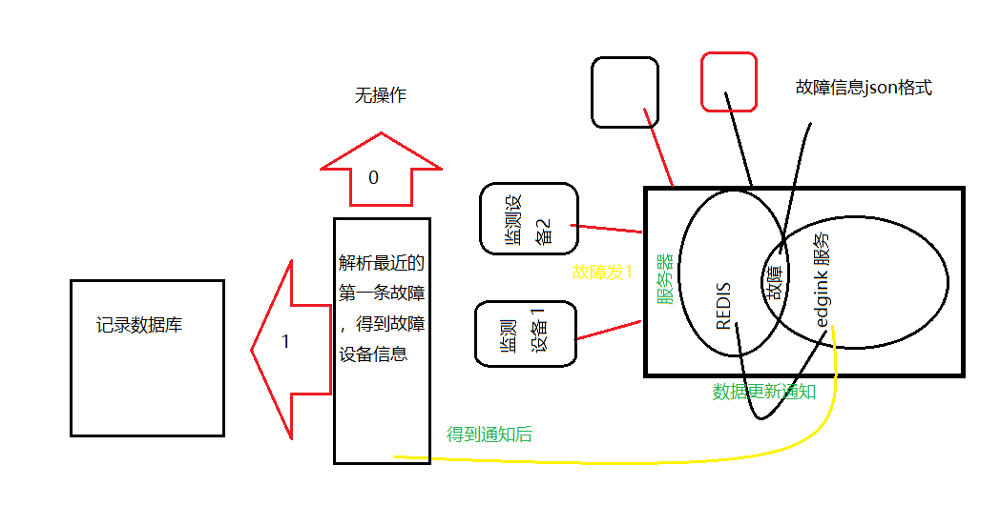

#### 概述

​		框架：.net（.netFramework 4.5.2）,语言：C#，应用方向：本地服务，redis缓存设备数据，目标平台：35号服务器 Windows平台

​		服务器信息：10.30.35.35, 未知  未知；

#### 业务流程	

​			

##### 

​		1.其中redis 服务和eglink服务在同一设备上；设备一旦发生故障会在redis上记录错误信息，订阅故障信息后，有新数据，redis会通过onmessage 通知edglink服务，后续由EdgeForTriggerService服务去redis故障记录位置读取错误数据，json格式

​		DealData函数

triggers由Where(x => x.plcName == msg.PlcName && x.tagName == msg.Tag.TagName).ToList()赋值，其数据来源服务注册目录底下的cofigFile,(path + "/EdgeForTrigger.json");

