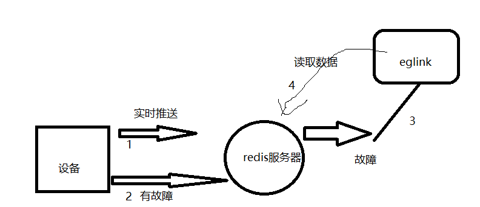
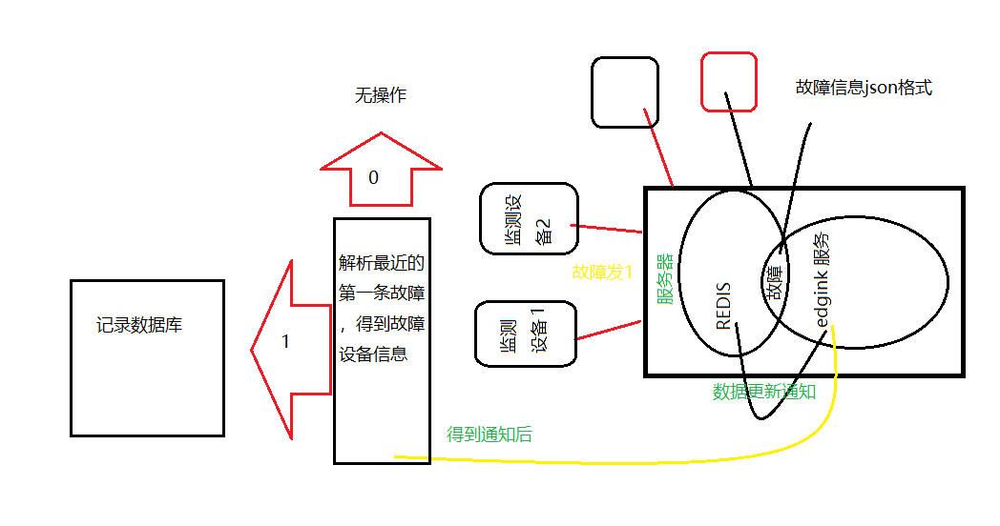

#### 概述

​		框架：.net（.netFramework 4.5.2）,语言：C#，应用方向：本地服务，redis缓存设备数据，目标平台：35号服务器 Windows平台

​		服务器信息：10.30.35.35, 未知  未知；

#### 业务流程	

##### 设备监控和数据库更新流程			

##### 

​		其中redis 服务和eglink服务在同一设备上；设备一旦发生故障会在redis上记录错误信息，订阅故障信息后，有新数据，redis会通过onmessage 通知edglink服务，后续EdgeForTriggerService服务会根据json格式的配置文件来决定收到消息后是的处理逻辑

##### DealData函数

​	triggers由Where(x => x.plcName == msg.PlcName && x.tagName == msg.Tag.TagName).ToList()赋值，其数据来源服务注册目录底下的cofigFile，路径：(path + "/EdgeForTrigger.json");

​	EdgeForTrigger.json此文件可用于导入trigger构造的from value和to value，这两个值影响着后续流程的判断，所以可以通过改变修改配置文件中这两个变量的值来改变此服务收到不同数据（0，1）后的处理逻辑，

​	之前的判断流程会导致：从redis收到连续的0->1跳变后，后一次不处理，现为了解决此问题，已将逻辑判断部分改为收到1即进行后续操作

##### 多线程消息处理

​	设备发生故障的时间和频率是不可预估的，当故障消息高频次的到达，需要防止后来的redis故障通知不会因为上一条消息的后续处理流程未完成而阻塞，此处必须使用异步多线程

​    每次收到redis的故障通知后，都会新起一个线程，而线程每进一次函数实际上都重新分配了一片存放临时变量的栈区，除非函数中使用了生命周期更长的变量或数据（类构造时初始化的变量，const修饰的变量），程序运行后会导致多个线程同时修改此变量，程序运行将完全脱离预期，

（未完...）

需要考虑的点：：

1.大量并发通知达到的同时，也意味着系统需要给程序提供高密度的线程、和栈区资源，又因为数据是并发的，线程占用的资源可能来不及释放，那么栈区资源就有耗尽的危险，可以尝试存放在堆区，而堆区数据的释放在C#，Java这些解释型语言中已经被托管了，堆区空间虽然大却依然面临着 数据释放不及时而资源耗尽的风险，似乎解决此问题需要一个更为底层的语言？另外一个问题是cpu资源是否也会构成瓶颈？这也很难说，，，

2.多线程打印的log往往极其混乱，可能前一条是设备1的故障信息，后一条就是设备2的故障信息了，这也是个棘手的问题，既要避免单一线程打log，后发的log被前面的阻塞导致纪录的时间不准，又要避免多线程打印引起的记录混乱

